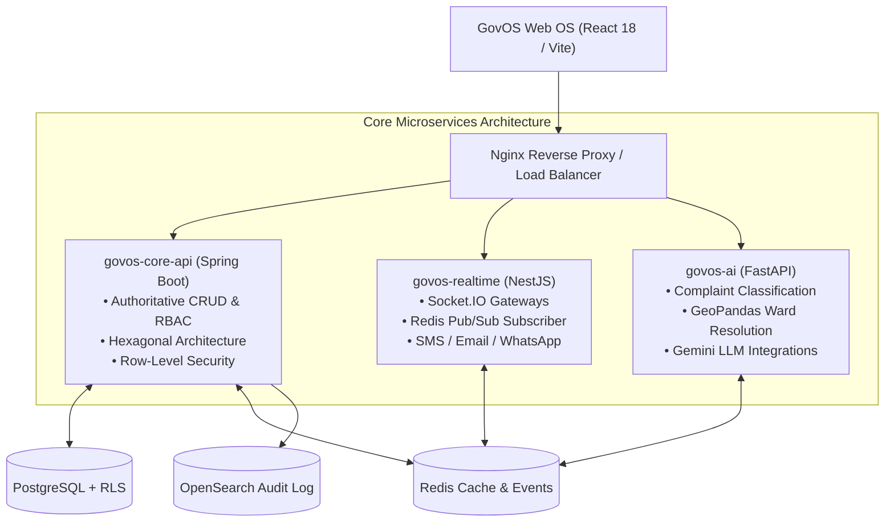
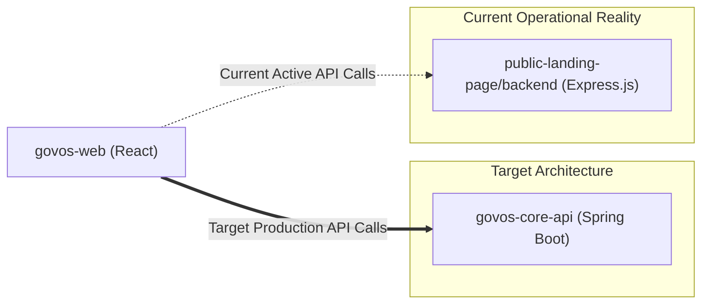
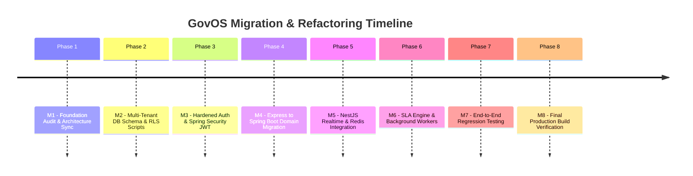
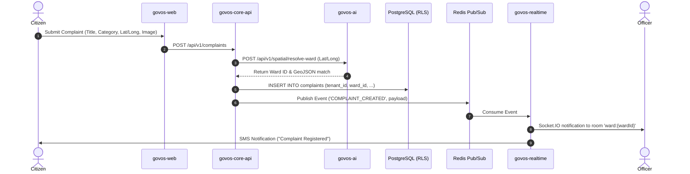

# GovOS — Web Operating System for Civic Governance
## Platform Architecture & Technical Walkthrough

> [!IMPORTANT]
> **GovOS** is a multi-tenant Web Operating System engineered to modernize municipality and civic governance. This document provides a complete technical walkthrough of the architecture, database schema, microservice ecosystem, audit findings, and execution roadmap.

---

## 1. System Overview & Core Philosophy

GovOS operates as a **Web Operating System (Web OS)**. Rather than isolated form-based tools, it provides an integrated multi-tenant control plane for local government administration, citizen complaint lifecycles, asset tracking, project management, and real-time civic intelligence.



---

## 2. Microservices & Component Breakdown

| Microservice | Technology | Primary Responsibility | Key Characteristics |
| :--- | :--- | :--- | :--- |
| **`govos-web`** | React 18 + Vite + Tailwind | Frontend Web OS Shell & 11 Sub-Modules | Desktop windowing feel, Zustand state, TanStack Query, Framer Motion |
| **`govos-core-api`** | Java 21 / Spring Boot 3 | Core Business Engine, Auth, RBAC, DB CRUD | Hexagonal architecture, JPA/Hibernate, Flyway migrations |
| **`govos-realtime`** | Node.js / NestJS | Realtime Sockets & Multi-Channel Notifications | Socket.IO room management (`tenant:{id}`, `ward:{id}`), Redis subscriber |
| **`govos-ai`** | Python 3.11 / FastAPI | AI Intelligence & Spatial Analysis | GeoPandas point-in-polygon ward mapping, Google Gemini 2.0/1.5 integration |
| **`public-landing-page`**| Next.js / Express | Legacy Backend & Public Portal | Contains legacy Express API (`public-landing-page/backend`) being ported |

---

## 3. Data Isolation & Multi-Tenant Model (MTAS)

Multi-Tenancy is enforced at the database level using **PostgreSQL Row-Level Security (RLS)** in conjunction with Spring Security's `TenantAuthenticationToken`.

### Multi-Tenant Schema Standards
Every tenant-scoped table strictly includes mandatory audit and isolation fields:

```sql
CREATE TABLE complaints (
    id          UUID PRIMARY KEY DEFAULT gen_random_uuid(),
    tenant_id   UUID NOT NULL REFERENCES tenants(id),
    title       VARCHAR(255) NOT NULL,
    description TEXT,
    status      VARCHAR(50) NOT NULL DEFAULT 'SUBMITTED',
    ward_id     UUID REFERENCES wards(id),
    is_deleted  BOOLEAN NOT NULL DEFAULT FALSE,
    created_at  TIMESTAMPTZ NOT NULL DEFAULT NOW(),
    updated_at  TIMESTAMPTZ NOT NULL DEFAULT NOW(),
    created_by  UUID REFERENCES users(id)
);

-- Row Level Security Policy Enforcement
ALTER TABLE complaints ENABLE ROW LEVEL SECURITY;

CREATE POLICY tenant_isolation_policy ON complaints
    USING (tenant_id = current_setting('app.tenant_id')::uuid);
```

> [!TIP]
> **Spring Security Integration:** At the beginning of each database transaction, the Spring Boot backend sets the local session variable:
> `SET LOCAL app.tenant_id = '{tenantId}';`
> This guarantees mathematical data isolation even if developer queries omit `WHERE tenant_id = ?`.

---

## 4. Current Codebase Audit & "Split-Brain" Analysis

A comprehensive audit (`govos_implementation_audit.md`) revealed a temporary structural divergence ("split-brain backend"):



### Key Audit Highlights:
1. **Frontend (`govos-web`)**: High maturity (~75%). UI components, dashboards, role-based interfaces, and Zustand state are well-crafted.
2. **Backend**: Active business logic sits in `public-landing-page/backend` (Express.js), while `govos-core-api` (Spring Boot) is being prepared as the production backend.
3. **Database**: A 20+ table monolithic schema exists in `schema.sql`. Migration scripts (`01_add_tenants_and_rls.sql`) add tenant boundaries and RLS policies.

---

## 5. Foundation Fix & Migration Roadmap

To transition to the target architecture safely, the following 8-phase execution plan (`govos_foundation_fix_plan.md`) is established:



---

## 6. End-to-End User Workflows

### A. Citizen Complaint Lifecycle



### B. Role-Based Access Control (RBAC) Matrix

| Persona | Accessible Scope | Key Capabilities |
| :--- | :--- | :--- |
| **`SUPER_ADMIN`** | Cross-Tenant / Platform | Tenant provisioning, global analytics, system configuration |
| **`TENANT_ADMIN`**| Single Tenant Scope | Department management, officer rostering, ward configuration |
| **`DEPT_HEAD`** | Tenant + Department Scope| Asset allocation, project oversight, SLA escalation management |
| **`OFFICER`** | Assigned Ward / Department | Complaint verification, field resolution, status updates |
| **`ROLE_REP`** | Ward / Constituency Scope | Public grievance directives, citizen constituency insights |
| **`CITIZEN`** | Self-Created Records Only | Complaint submission, track resolution progress, feedback |

---

## 7. Next Steps for Execution

> [!NOTE]
> 1. Execute **M2 Database Migration** (`01_add_tenants_and_rls.sql`) to establish `tenants` table and RLS policies.
> 2. Complete domain-by-domain porting from Express controller endpoints to Spring Boot `@RestController` services.
> 3. Verify Redis event pub/sub connection between Spring Boot and NestJS for real-time WebSocket room broadcasts.
