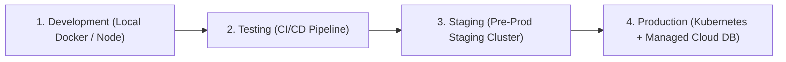

# GovOS — Environment Configuration & Setup Strategy
**Milestone:** M0.5 — Codebase Hardening & Cleanup
**Date:** August 29, 2026

---

## 1. Environment Strategy Overview

GovOS enforces isolated configuration profiles across four deployment tiers:



1. **Development (`development`)**: Local development environment with hot-reloading (`npm run dev`), mock OTP logging, and local Docker PostgreSQL/Redis.
2. **Testing (`testing`)**: Automated CI/CD integration testing environment.
3. **Staging (`staging`)**: Staging replica environment connected to staging DB with real SMS/Email test credentials.
4. **Production (`production`)**: Production deployment. Strict secret enforcement (no default fallbacks), SSL enabled, rate-limiting active, RLS enforced.

---

## 2. Complete Environment Variable Matrix

| Variable Name | Description | Default (Dev) | Required in Prod? | Service |
| :--- | :--- | :--- | :--- | :--- |
| `NODE_ENV` | Application environment state | `development` | **YES** | Node/Express, NestJS |
| `PORT` | Service HTTP port | `5000` | **YES** | Express Backend |
| `JWT_SECRET` | Secret key for signing JWT tokens (min 32 chars) | `govos_dev_secret_jwt_key_32_characters_minimum` | **YES (Must be random)** | Express, Spring, NestJS, Python |
| `JWT_EXPIRES_IN` | JWT token expiration duration | `24h` | **YES** | Express, Spring |
| `DB_HOST` | PostgreSQL Database Host | `localhost` | **YES** | Express |
| `DB_PORT` | PostgreSQL Database Port | `5432` | **YES** | Express |
| `DB_NAME` | PostgreSQL Database Name | `govos_db` | **YES** | Express |
| `DB_USER` | PostgreSQL User | `govos_user` | **YES** | Express |
| `DB_PASSWORD` | PostgreSQL Password | `govos_dev_secret` | **YES** | Express |
| `SPRING_DATASOURCE_URL` | JDBC Connection String | `jdbc:postgresql://localhost:5432/govos_db` | **YES** | Spring Boot |
| `SPRING_DATASOURCE_USERNAME` | Spring DB User | `govos_user` | **YES** | Spring Boot |
| `SPRING_DATASOURCE_PASSWORD` | Spring DB Password | `govos_dev_secret` | **YES** | Spring Boot |
| `REDIS_HOST` | Redis Server Host | `localhost` | **YES** | NestJS, Spring, Python |
| `REDIS_PORT` | Redis Server Port | `6379` | **YES** | NestJS, Spring, Python |
| `USE_CLOUDINARY` | Toggle Cloudinary file uploads | `false` | Optional | Express |
| `CLOUDINARY_CLOUD_NAME` | Cloudinary Cloud Account Name | N/A | Optional | Express |
| `CLOUDINARY_API_KEY` | Cloudinary API Key | N/A | Optional | Express |
| `CLOUDINARY_API_SECRET` | Cloudinary API Secret | N/A | Optional | Express |

---

## 3. Setup Commands by Environment

### A. Development (Local)
```bash
# 1. Start Database & Redis via Docker Compose
docker-compose -f infra/docker/docker-compose.yml up -d postgres redis

# 2. Run Express Backend (Legacy)
cd public-landing-page/backend
npm install
npm run dev

# 3. Run Frontend Web OS
cd govos-web
npm install
npm run dev
```

### B. Production Environment Checklist
- [ ] `JWT_SECRET` generated using strong entropy (`openssl rand -hex 32`).
- [ ] Database credentials loaded from secure secrets manager (AWS Secrets Manager / Vault).
- [ ] `NODE_ENV` set to `production`.
- [ ] CORS origins strictly limited to domain whitelist.
